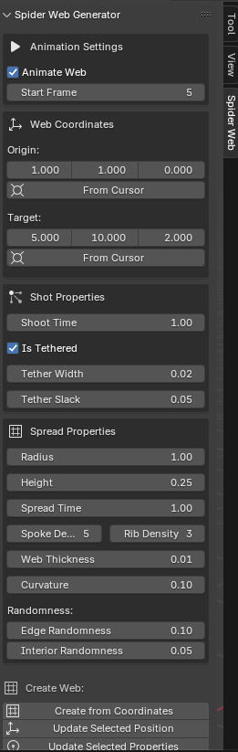

### Blender Spider Web Shooter Add-on

A tool for Blender that provides a panel for generating stylized spider webs and web-shooting effects similar to the powers of Spider-Man.

**Key Features**
- Generate Spider Webs and customize
    - Size
    - Shape
    - Number of spoke and ribs
    - Curvature
- Generate Animation
    - Web spreading
    - Shot projectile
    - Web tethers
- Easy to make edits to the web and iterate on different designs

